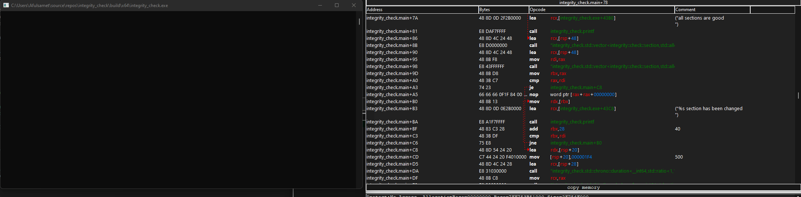

# Memory integrity check
Iterate all non-writable sections with `IMAGE_SCN_MEM_WRITE` in specified module.\
Hash original bytes of section with `_mm_crc32_u8` once then repeat steps in loop and compare new bytes with `compare_checksums`

# Example for usage
```cpp
std::int32_t main() {
	integrity::check check = integrity::check();

	while (true) {
		const std::vector<integrity::check::section>& sections = check.compare_checksums(check.retrieve_sections());

		if (sections.size() == std::size_t())
			std::printf("all sections are good\n");

		for (const integrity::check::section& section : sections)
			std::printf("%s section has been changed\n", section.name);

		std::this_thread::sleep_for(std::chrono::milliseconds(500));
	}

	return EXIT_SUCCESS;
}
```

# POC
